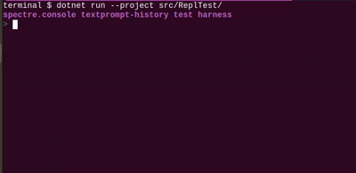

# `TextPromptWithHistory`

A .NET library that makes it easier to create even more useful `TextPrompt`s in `Spectre.Console` by adding shell history super powers to support REPL environments.

A simple REPL app is included in the `ReplTest` directory.

Detailed instructions for using `Spectre.Console` are located on their project website, https://spectreconsole.net

## Table of Contents

1. [Features](#features)
1. [Installing](#installing)
1. [Documentation](#documentation)
1. [Examples](#examples)
1. [License](#license)

## Features

* Supports up/down arrow using `TextPromptWithHistory` to scroll through history items.
* Clones `TextPrompt` from `Spectre.Console` to provide other functionalit you would expect
  on any text prompt in the base library.
* Written with unit testing in mind.



## Important Notices

## Installing

The fastest way of getting started using `TextPromptWithHistory` is to install the NuGet package.

```csharp
dotnet add package Spectre.Console.Community.TextPromptWithHistory
```

## Documentation

This is a community extension that is in no way associated with `Spectre.Console`'s project.  However, the documentation for `Spectre.Console` can be found at https://spectreconsole.net

This project is an extension that does not work without using `Spectre.Console`.

## Examples

To see `TextPromptWithHistory` in action, please see the `ReplTest` console app project which
demonstrates the usage and will give you the ability to enter commands to see the behavior first
hand.

## License

Copyright © Sean A. McElroy

`TextPromptWithHistory` is provided as-is under the MIT license. For more information see LICENSE.

This project incorporates code from `Spectre.Console`, which those authors provide as-is under the MIT license. For more information see their project and associated licenses.
